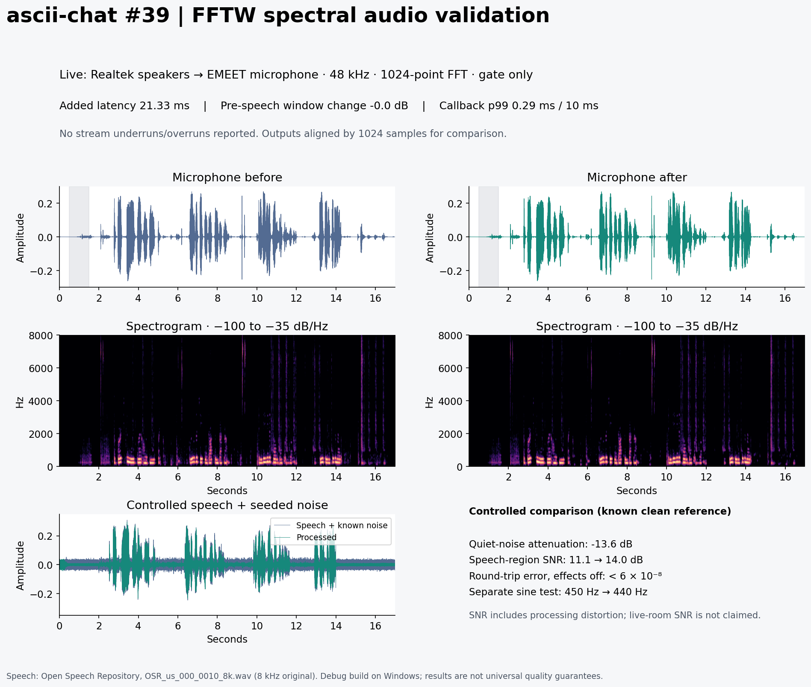

# Issue 39 validation evidence

Windows Debug build, Clang 23, 48 kHz mono. These recordings use the compiled
`spectral_process` implementation from `asciichat.dll`, driven in 480-sample
PortAudio callbacks through Python sounddevice. The physical loop used Realtek
speakers and the EMEET SmartCam Nova 4K microphone. It did not traverse the network.

- [Physical microphone, before](microphone-before.wav)
- [Physical microphone, after spectral gating](microphone-after.wav)
- [Controlled speech plus noise, before](controlled-before.wav)
- [Controlled speech plus noise, after spectral gating](controlled-after.wav)
- [Clean reference speech](reference.wav)
- [Measurements](analysis.json) and [DSP tests / benchmarks](spectral-results.json)

The physical WAVs preserve the processor's 1024-sample delay. The plot and controlled
WAVs compensate for that delay. WAVs are 48 kHz, 16-bit mono. Spectrogram scales
match. The physical pre-speech window includes transients and shows effectively
no reduction; no live-room SNR improvement is claimed. The controlled test uses
seed 39, broadband Gaussian noise plus a 187.5 Hz hum. Its silence-window reduction
is 13.6 dB, and speech-region SNR (including processing distortion) is 11.1 to 14.0 dB.
Those are different measurements, not a general 13.6 dB speech-SNR improvement.

The physical test reported no stream overruns/underruns; p99 DSP callback time was
0.29 ms and maximum 0.91 ms for a 10 ms block. Pure-tone gating reached 18 dB.
Effects-off reconstruction error was below 6e-8 for all three FFT sizes. A separate
pitch test shifted 450 Hz to 440 Hz. Full-effects Debug benchmarks are in JSON and
include the substantially more expensive optional pitch detector.

The focused tests passed, including the real AEC3/capture chain and independent
per-recipient mixer histories. A full client/server connection attempt failed with
`CLIENT_CAPABILITIES payload size 131072 (expected 168)` and client exit 44, before
sustained streaming. That application-level check did not pass.

Speech attribution: **Open Speech Repository**, file
[OSR_us_000_0010_8k.wav](https://www.voiptroubleshooter.com/open_speech/american/OSR_us_000_0010_8k.wav),
first 12 seconds, resampled from the original 8 kHz recording. The repository
[permits copying and publishing before/after examples with attribution](https://www.voiptroubleshooter.com/open_speech/index.html).
The controlled reference uses polyphase resampling; physical speaker playback uses
linear interpolation. Reproduction scripts are in `tests/audio/`.
