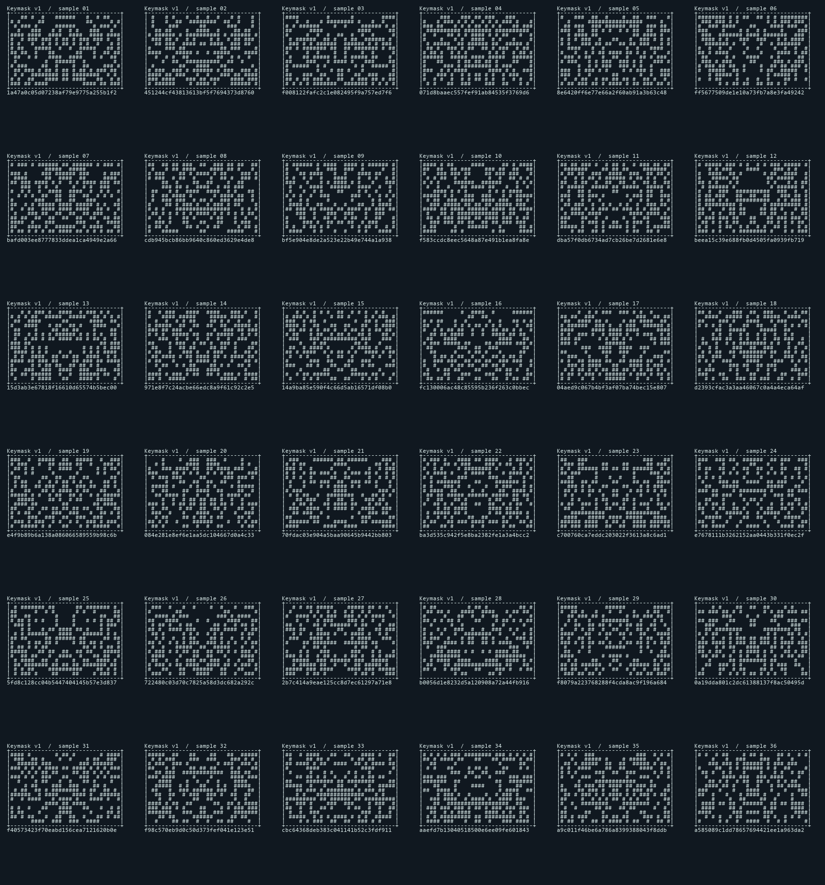

# Keymask public-key art

Keymask is ascii-chat's deterministic, monochrome public-key emblem. It supplements
the full SHA-256 fingerprint and existing authentication checks. A similar-looking
picture is not proof that two keys match.

Art appears automatically on interactive stderr terminals outside snapshot mode,
when the terminal has room. Redirected output keeps the textual fingerprint.
Quiet, grep, and JSON output retain their existing notice policies.

## Stable v2 mapping

1. Compute SHA-256 of the 32 public-key bytes. This remains the full fingerprint.
2. For each feature, compute SHA-256 of the UTF-8 domain `ascii-chat/keymask/v2`,
   a NUL byte, the 32-byte fingerprint, and the ASCII feature name: `outline`,
   `crown`, `eyes`, `center`, `mouth`, or `markings` (no trailing NUL).
3. Select one of eight silhouette profiles, eight crowns, eight eye pairs, six
   noses, and eight mouths using the first byte of the corresponding feature
   hash modulo the template count. Outline byte 1 selects single/double edges.
4. Stamp features into a 32 by 16 canvas. Cheek details use markings bytes 7-10;
   bytes 0-1 select the position and side of an asymmetric stripe. Template
   tables and placement rules in `keymask.c` define the versioned mapping.
5. Render ASCII literally; Unicode replaces only `#` with `░`. Surround the
   canvas with a 34-column, 18-row border and display `Keymask v2 / SHA-256`
   followed by the unchanged complete fingerprint.

V2 prioritizes recognizable shapes and empty space over random texture. It does
not preserve all 256 digest bits in its output. Exact visual collisions and
perceptual lookalikes are possible, including through deliberate key searches;
compare the full fingerprint for exact identity verification. V1 artwork changes
under v2, but saved trust records and fingerprints do not change.

SSH, raw X25519, and GPG Ed25519 public-key objects use the same mapping. Identical
public bytes produce identical art regardless of file, agent, or network source.
The algorithm label distinguishes Ed25519 from X25519; GPG metadata is not part of
the hash. The fingerprint convention is ascii-chat's existing SHA-256 of raw key
bytes, not OpenSSH's hash of its serialized SSH key blob.

## Display behavior

- Servers announce their configured public identities at startup; discovery-service
  announces its public identity too.
- Clients show the presented server identity after the existing key checks. The
  label explicitly says unverified if signature verification was not enabled.
- Servers show a client's public identity after handshake completion, labeled with
  its connection ID and authenticated/unverified status. Anonymous clients have no
  persistent key art.
- Unknown-host prompts include art when it fits. Short terminals (fewer than 38
  rows) keep just the fingerprint so the question and input remain accessible.
- Changed-host warnings show received and stored identities. When several stored
  keys exist, the first nonzero candidate is labeled as such. Missing stored
  identities are described as unavailable, never visualized as a zero key.
- If the available notice content width is below 34 columns, only the fingerprint
  is shown. The existing UI controller handles later terminal resizes and prompt
  minimum dimensions.

Trust decisions, known-host file format, and network packets are unchanged.

## Implementation and verification

`lib/crypto/key_identity/keymask.c` contains the allocation-free mask renderer
and shared public-key digest function. `display.c` formats identity cards and
applies terminal/notice policy. Public headers mirror that directory under
`include/ascii-chat/crypto/key_identity/`.

Build using the default CMake preset, then run against the compiled shared library:

```sh
python tests/integration/keymask.py --library build/bin/asciichat.dll --terminal --binary build/bin/ascii-chat.exe
```

Use the corresponding `.so`/`.dylib` path on other platforms. The core checks use
only Python's standard library. `--terminal` additionally requires `pyte` and
`pywinpty` on Windows, or `pexpect` on POSIX. `--contact-sheet output.png` uses
Pillow to render 36 deterministic examples from the native renderer.

The tests cover a fixed v2 golden vector, all 256 single-bit input mutations, ASCII/UTF-8
equivalence, buffer boundaries, SHA-256 parity, public-key imports, narrow layouts,
stored-key comparisons, noninteractive rejection, and real PTY/ConPTY notices and
trust prompts. `--binary` additionally exercises a real loopback server/client
authenticated snapshot with temporary SSH keys (requires `ssh-keygen`), checking
both identity cards and that snapshot stdout stays clean. They use temporary fixtures and isolate the user config directory.

## Example contact sheet

These 36 synthetic digest fixtures are rendered by the compiled C implementation.


