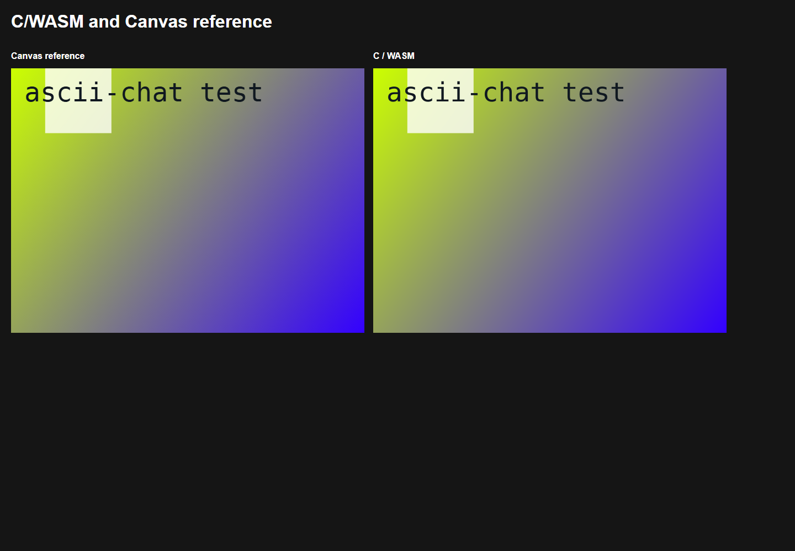
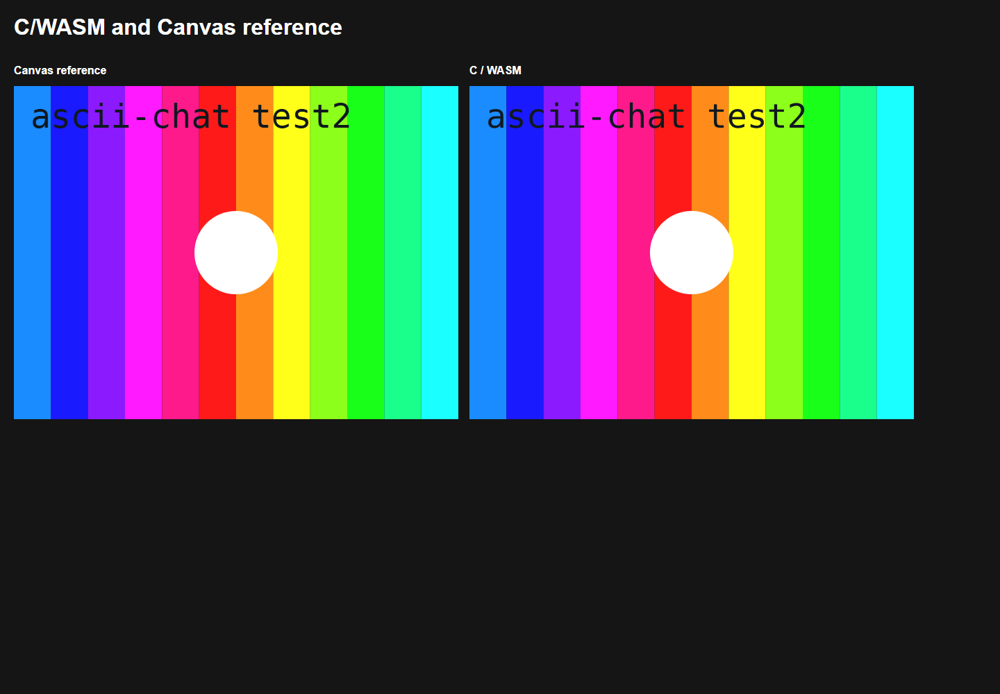

# Shared native and browser test patterns

`--test-pattern` and `--test-pattern 0` select the animated gradient and translucent square. `--test-pattern 1` selects rainbow stripes and a wrapping white circle. Both also accept `=0`/`=1`. Omitting the flag leaves normal source selection unchanged; `0` means the first animation, not disabled. The option is available in mirror, client, and discovery modes.

```sh
ascii-chat mirror --test-pattern
ascii-chat mirror --test-pattern 1 --color-mode 256
ascii-chat client localhost --test-pattern=0
```

`WEBCAM_DISABLED=1` remains a boolean enable switch; with default configuration it enables pattern zero. Existing boolean `[webcam] test_pattern = true/false` configuration remains supported; integer `0` or `1` enables the selected animation. CLI selection overrides configuration/environment values.

The browser maps `?test` to pattern zero and `?test2` to pattern one. `?test2&testCadence` explicitly enables the full-height Gray-code diagnostic overlay; ordinary `?test2` now shows its stripes and circle.

## Implementation

`lib/video/anim/test_pattern.c` owns the RGB animations, bundled-font labels, and optional reusable RGBA output. Each media source/canvas has an independent renderer, cached labels, and reusable image buffers. Its public API takes elapsed milliseconds, making animation speed independent of capture FPS and allowing deterministic comparisons. Native sources use a monotonic clock. Geometry adapts below the former Canvas minimum shape sizes so the minimum 20x10 terminal can still show the shapes and colors.

`src/web/common/test_pattern.c` exposes this same implementation to both WASM modules. TypeScript only copies/uploads the generated RGBA frame and manages source lifetime. The mirror consumes the returned frame without reading the canvas back.

The existing terminal palette helpers are shared by the normal render pipeline. `rgb_to_256color` now compares the nearest nonuniform xterm cube entry with the nearest grayscale entry, including exact black and white. `get_256color_rgb` supplies the inverse palette lookup; the existing 16-color helpers supply the other direction. Palette expansion uses the standard reference colors (the first 16 actual terminal colors may be themed).

## Visual verification (2026-10-09)

The test-only Canvas reference comes from `37028bd7e`. It is kept outside production imports for regression comparisons. Two changes to the baseline are explicit:

- Disable the previously unconditional cadence overlay for the visible second animation.
- Use the bundled DejaVu Sans Mono font for labels instead of an OS-dependent `sans-serif` face. Native and WASM use FreeType; the reference browser loads the exact same font bytes. This is a deliberate font change, not a claim of pixel identity with the former system font.

The pixel comparison covers both patterns at 320x240, 640x480, 801x603, and 1920x1080, each at 0, 1000, 2000, 3999, 4000, and 9999 ms. It also checks exact cadence-overlay output across its Gray-code wrap. The fixed-time screenshots below were inspected visually. Small edge/font antialiasing and RGB rounding differences are allowed by explicit test thresholds: mean channel error below 2/255, fewer than 2.5% of pixels with any channel error above 8, and mean geometry error below 1/255. Actual measurements are in [pixel-metrics.json](test-pattern-evidence/pixel-metrics.json).




The native shared library also generated [pattern zero](test-pattern-evidence/native-pattern-0.png) and [pattern one](test-pattern-evidence/native-pattern-1.png) at 2000 ms. Actual application screenshots: [mirror zero](test-pattern-evidence/test-mirror.png), [mirror one](test-pattern-evidence/test2-mirror.png).

## Checks and limits

- Windows Clang native build, both Emscripten WASM builds, workspace `vp check`, and the web application production build pass.
- Native executable: 30 snapshots covering both selectors/bare flag, 16/256/truecolor, and minimum/normal dimensions. Invalid selectors, default/repeated selection, legacy environment and config inputs pass.
- Native shared library: all 256 reference palette entries round-trip; independent renderers, deterministic timestamps, buffer reuse, resize, and invalid input checks pass. See [native-results.json](test-pattern-evidence/native-results.json).
- Focused Playwright suite: fixed-time visual comparisons, WASM lifetime/resize checks, 1080p generation timing, and actual mirror rendering/stop for both patterns pass.
- Source generation measured about 6–7 ms median at 1080p, including canvas upload, after warmup. The paired Canvas reference measured about 5–8 ms. [Recorded timing](test-pattern-evidence/generation-timing.json) is machine-specific, not an end-to-end 60-FPS guarantee.
- The strict 1080p mirror visual-change test fails on this machine with both the original Canvas generator and the C generator. The 15-second native-server/browser-client run receives and repaints approximately 60 FPS, but its distinct-ASCII metric averages about 50 FPS and fails its 55-FPS threshold. These stricter end-to-end cadence checks are not claimed as passing.
- The configured web unit suite has eight failures in frame-parser, renderer-resize, and encryption-policy tests. The same eight failures were reproduced with the modified shared TypeScript files restored to the base revision. All three focused test-pattern unit tests pass. The workspace-root test command additionally collects Playwright files as Vitest tests; use the application's Vitest config.
- Criterion tests were updated but not run on Windows, where Criterion is unsupported. Native C behavior was exercised through the actual shared library instead.
- Native `--render-file .png` fails in the existing FFmpeg encoder initialization in this environment; the native source images above were captured directly from the library. Native terminal output itself passes the color-mode snapshot checks.

## Reproduce

```sh
cmake --preset default -B build
cmake --build build --target ascii-chat
python tests/platform/test_pattern.py --binary build/bin/ascii-chat.exe --library build/bin/asciichat.dll
# Build mirror-web/client-web using the configured Emscripten build, then publish:
cd web/web
vp run wasm:build
vp exec playwright test --config playwright.pattern.config.ts test-pattern-parity.spec.ts
vp test run --config vitest.config.ts tests/network/test-pattern.test.ts
```

The Playwright configuration uses port 3810 to avoid interfering with an existing developer server. Rebuild/publish the WASM artifacts before running it; the paired tests load the same artifacts used by the application.
